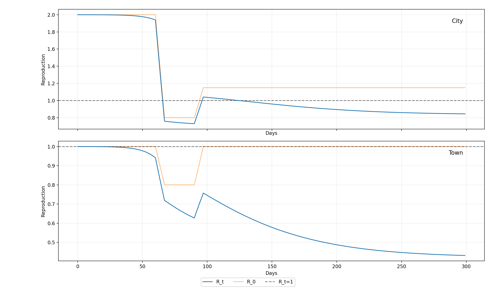

# metapop
Discrete time SEIR metapopulation modelling for epidemic spread

## Charts
### Rt

### Case Counts

### Dynamics

## usage
Then to make the toy data run
`make data`
to run the code type
`make`
and to plot the results
`make chart`.
If all of that is too much typing, just do 
`make full`
instead.

If you want to move the file format to something that is the same
as `uk_cases.csv` then you can do
`make coerce`
and then `/data/metapop/outputs/cases.csv` will be the file you should read.

If you want to run the file and also coerce the csv, then do
`make csv`.

If you look at the Makefile then it should be clear.

## Reproducing Gostic et al
To reproduce the dynamics of gostic et al (eg last figure in the paper)
you can change the makefile to use the data name `gostic-single`
and then run `make execute && make chart` to see the results.
